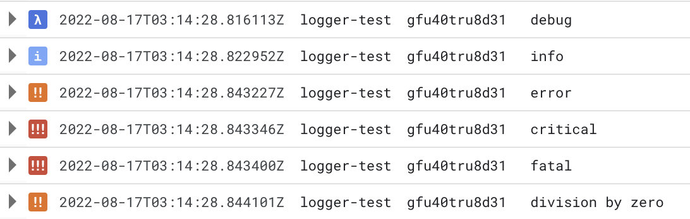
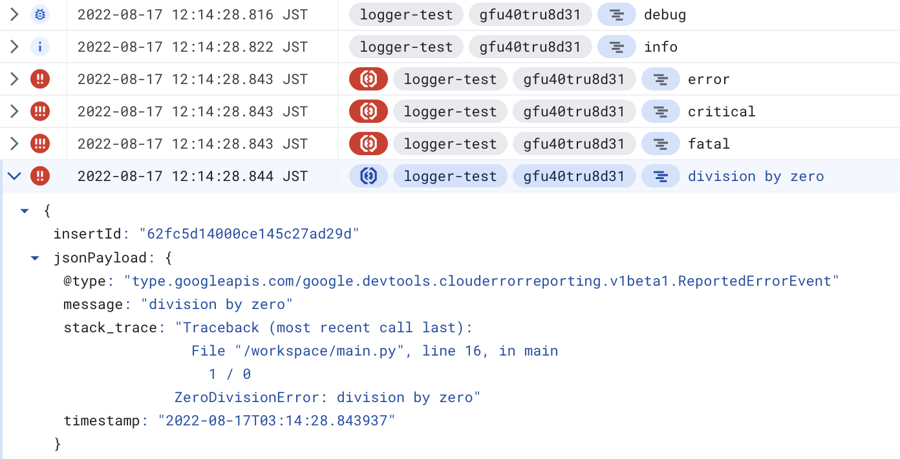

# Structured Logger

Formatter for [structured logging](https://cloud.google.com/logging/docs/structured-logging) in Google Cloud.

# Installing

```
pip install google-cloud-structured-logger
```

# Usage

```python
import logging
from gcstructuredlogger import structuredlogger

logger = logging.getLogger(__name__)
logger.setLevel(logging.DEBUG)

log_handler = logging.StreamHandler()
formatter = structuredlogger.StructuredJsonFormatter()
log_handler.setFormatter(formatter)
log_handler.setLevel(logging.DEBUG)
logger.addHandler(log_handler)
```

## Dict config example

```python
import logging.config

from gcstructuredlogger import structuredlogger

LOGGING_CONFIG = {
    "version": 1,
    "disable_existing_loggers": False,
    "formatters": {
        "structured_json": {
            "()": structuredlogger.StructuredJsonFormatter
        }
    },
    "handlers": {
        "default": {
            "formatter": "structured_json",
            "level": "DEBUG",
            "class": "logging.StreamHandler",
            "stream": "ext://sys.stdout",
        }
    },
    "root": {
        "level": "DEBUG",
        "handlers": ["default"]
    },
}

logging.config.dictConfig(LOGGING_CONFIG)
```

## Features

- `severity` is set to the same level as the log
- Send log to Error Reporting if log level is `ERROR`, `CRITICAL`, or `FATAL`
- If `exc_info` is `True`, the stack trace is set to `stack_trace`

## Log example

`main.py`:

```python
logger.debug("debug")
logger.info("info", extra={"foo": "bar"})
logger.error("error")
logger.critical("critical")
logger.fatal("fatal")

try:
    1 / 0
except Exception as e:
    logger.error(e, exc_info=True)
```

Output:

```
{"message": "debug", "timestamp": "2022-08-18T12:55:52.064302", "severity": "DEBUG"}
{"message": "info", "foo": "bar", "timestamp": "2022-08-18T12:55:52.064358", "severity": "INFO"}
{"message": "error", "timestamp": "2022-08-18T12:55:52.064381", "severity": "ERROR", "@type": "type.googleapis.com/google.devtools.clouderrorreporting.v1beta1.ReportedErrorEvent"}
{"message": "critical", "timestamp": "2022-08-18T12:55:52.064399", "severity": "CRITICAL", "@type": "type.googleapis.com/google.devtools.clouderrorreporting.v1beta1.ReportedErrorEvent"}
{"message": "fatal", "timestamp": "2022-08-18T12:55:52.064414", "severity": "CRITICAL", "@type": "type.googleapis.com/google.devtools.clouderrorreporting.v1beta1.ReportedErrorEvent"}
{"message": "division by zero", "stack_trace": "Traceback (most recent call last):\n  File \"/path/to/main.py\", line 16, in main\n    1 / 0\nZeroDivisionError: division by zero", "timestamp": "2022-08-18T12:55:52.064520", "severity": "ERROR", "@type": "type.googleapis.com/google.devtools.clouderrorreporting.v1beta1.ReportedErrorEvent"}
```

### Logs displayed in Google Cloud

Cloud Function:


Cloud Logging:

